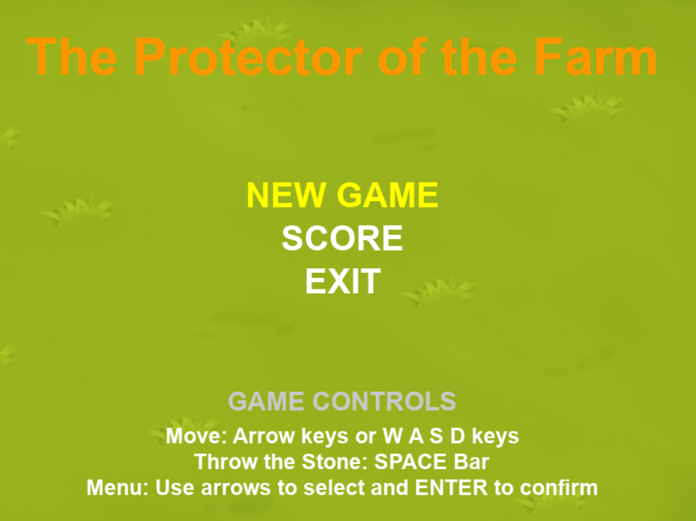
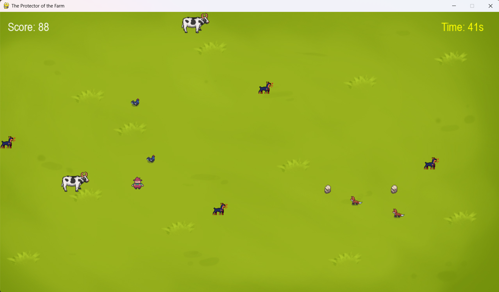

# The Protector of the Farm 🚜

*Read this in [English](#english) | Leia em [Português](#português)*

---

##  🇧🇷 Português

Um jogo 2D desenvolvido em Python como projeto prático. O objetivo principal é controlar o personagem para proteger a fazenda e seus animais contra as ondas de inimigos, utilizando mecânicas de movimentação e tiro.

### ✨ Funcionalidades
* **Mecânica de Tiro e Defesa:** Movimentação fluida do jogador para interceptar inimigos antes que atinjam as presas.
* **Sistema de Níveis:** Progressão de dificuldade e gerenciamento de fases.
* **Registro de Pontuação:** Sistema integrado com banco de dados SQLite (`farm_scores.db`) para salvar as melhores pontuações localmente.
* **Orientação a Objetos:** Código estruturado com princípios de POO (Arquivos separados para Player, Enemy, Level, etc.).

### 🎮 Controles
* **Setas Direcionais:** Movimentam o personagem pela tela.
* **Barra de Espaço:** Dispara contra os inimigos.

### 💻 Tecnologias Utilizadas
* Python 3
* Pygame (Biblioteca gráfica para renderização do jogo 2D)
* SQLite3 (Banco de dados leve para o placar)

### 🚀 Como executar o projeto na sua máquina
1. Certifique-se de ter o Python instalado.
2. Clone este repositório: `git clone https://github.com/lahisrodrigues/The-Protector-of-the-Farm.git`
3. Instale as dependências: `pip install -r requirements.txt`
4. Execute o arquivo principal: `python code/main.py`

---

##  🇺🇸 English

A 2D game developed in Python as a practical project. The main objective is to control the character to protect the farm and its animals against waves of enemies, using movement and shooting mechanics.

### ✨ Features
* **Defense & Shooting Mechanics:** Fluid player movement to intercept enemies before they reach the prey.
* **Level System:** Difficulty progression and stage management.
* **High Score Tracking:** Integrated SQLite database (`farm_scores.db`) to save local high scores.
* **Object-Oriented Programming:** Code structured with OOP principles (Dedicated modules for Player, Enemy, Level, etc.).

### 🎮 Controls
* **Arrow Keys:** Move the character around the screen.
* **Spacebar:** Shoot at the enemies.

### 💻 Tech Stack
* Python 3
* Pygame (Graphics library for 2D game rendering)
* SQLite3 (Lightweight database for the scoreboard)

### 🚀 How to run the project
1. Make sure you have Python installed.
2. Clone this repository: `git clone https://github.com/lahisrodrigues/The-Protector-of-the-Farm.git`
3. Install dependencies: `pip install -r requirements.txt`
4. Run the main file: `python code/main.py`